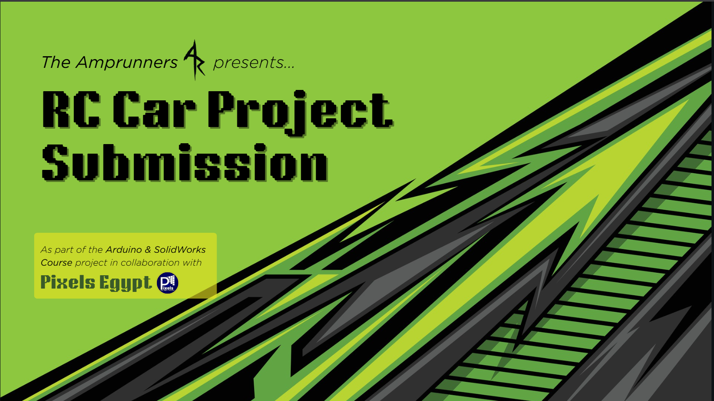
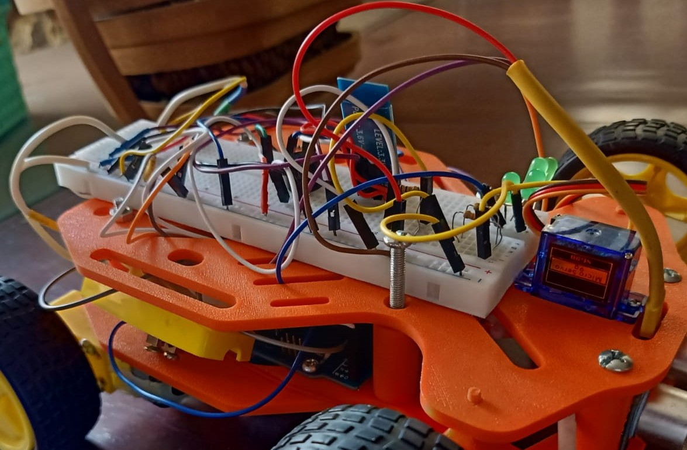
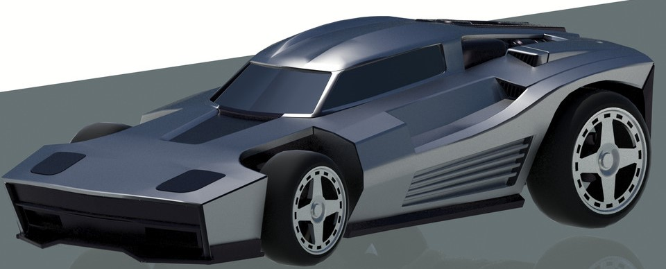

# ⚡ The Amprunners BT Car Project  
## Table of Contents
1. [Project Overview](#project-overview)  
2. [Components Used](#components-used)  
3. [Circuit Design](#circuit-design)  
4. [Code Implementation](#code-implementation)  
5. [Chassis & Assembly](#chassis--assembly)  
6. [Testing & Challenges](#testing--challenges)  
7. [Future Improvements](#future-improvements)  
8. [Credits](#credits)  

---

[](https://www.canva.com/design/DAGyNDEWMuc/WyMPQTmzuohv-2UcNLUx6A/view?utlId=hdddcee9b77#1)

> A course project built to demonstrate skills in electronics, microcontroller programming, and system integration.  

---

## Project Overview
This project was developed as part of a Pixel's Embedded Arduino and SolidWorks course to design and build a working toy car.

The goal was to build two cars from scratch, control them wirelessly using:
* Bluetooth module (as used in model APEX)  
* Mobile BT App (seen in model NOVA)
  
### [Amprunners Controller App (Android)](Amprunners_controller.apk)
### [🎥 Watch Demo Video (MP4)](docs/Demo.mp4)
---

## Components Used 
**3D model, wheels, chassis and assembly have their own section below*
- **Microcontroller:** Arduino Uno R3 (Car control)
- **Motor Driver:** L293D H-Bridge  
- **Motors:** 2x DC hobby motors (for RWD)
- **Steering:** SG90 micro servo motor
- **Sensors:** HC-SR04 ultrasonic (for obstacle detection)  
- **Communication:** HC-05 Bluetooth module 
- **Power:** 3.7V Li-ion battery x 3  
- **Sound:** TMB12A05 Active buzzer, KSP2222A Transistor
- **LEDs:** 3 pairs (red, white, and 3rd's your colour of choice) 
## Extra components for model APEX:
- **Control:** KY-023 PS2 joystick module
- **Microcontroller:** A second Arduino Uno R3 (Remote control) 
- **Communication:** HC-05 Bluetooth module 

---

## Circuit & System Design
#### Wiring Diagram 
- Wiring on [TinkerCAD](), or view the circuit as a [.brd file](hardware/circuit.brd)
-


#### Power distribution: 
*connecting the 3 batteries in series using a pack*

    Battery pack --> Kill switch --> H-Bridge +12V pin
    H-Bridge 5V pin --> 5V power rail --> Arduino's 5V power pin 
  <small>(more on this later)</small>  

### Pin Connections: 

##### Motors
| Component       | Pin / Connection   |
|-----------------|--------------------|
| Motor A IN1     | D3                 |
| Servo Control   | D4                 |
| Motor A IN2     | D5                 |
| Motor B IN1     | D6                 |
| Motor B IN2     | D9                 |

##### Comms.
| Component       | Pin / Connection   |
|-----------------|--------------------|
| BT Module Tx    | D0 (MCU Rx)        |
| BT Module Rx    | D1 (MCU Tx)        |
| Ultrasonic Trig | D8                 |
| Ultrasonic Echo | A0                 |


##### Others
| Component           | Pin / Connection   |
|---------------------|--------------------|
| Transistor (buzzer) | D2                 |
| HeadLights          | D11                |
| Reverse Lights      | D12                |
| Taillights          | D13                |


---

## 💻 Code
Main features of the code:
- Reads instructions from BT module/App.  
- Controls motors' speed (3 in each direction) via H-Bridge.
- Control steering via servo motor (front wheels) + one hobby motor (rear wheel)   
- Stops when obstacles are detected by ultrasonic, then starts beeping.
- Beeps periodically when backing up (like big trucks)
- Toggling on/off headlights and buzzer (horn)
- Reverse and Tail lights light up automatically according to movement 


#### *Code Snippet* 
##### [Full NOVA code available here](/src)
```cpp

switch (read){
  case 'F':  
    if(!stopFlag){
      forward(); digitalWrite(backled,LOW); digitalWrite(buzz,LOW);}
    else{
      stop(); digitalWrite(backled,HIGH); buzzAlert();}
      break;

  case 'B': 
    digitalWrite(backled,LOW); backward(); buzzRev(); ledRev(); 
    break;  
``` 
<sub>IDE: Arduino IDE 
Libraries: Servo.h   
Board: Arduino Uno R3   
Baud rate: 9600 baud   
</sub>   


---


## Chassis & Assembly 
Our team agreed on making the car RWD, rather than AWD; simply because it was more economical

> Using [this model](https://www.thingiverse.com/thing:4772279) made by Pammeg80 on Thingiverse.com as our inspiration , with some slight adjustments

#### Alterations to base model:
1. Made a small hole using SolidWorks to fit the pins for the ultrasonic sensor
-

2. Removed the 9V power at the back, while mounting the 12V pack (mentioned here) under the model 
-

3.  Adding a nameplate for visuals with a "THOMAS" text ingravement + LED Holes 
-

4. Small pillars to hold headlight's LEDs (Not saved unfortunately)  

---

## Testing
### Phase 1: Wiring test
This was done by adding a Keyboard (of varing resistance) to one analogue pin, and manually taking resistance reading to form a resistance-to-key map.
The following map was created:

```cpp
//Keypad Resistance Map//
#define ast_KEY 47
#define zero_KEY 51
#define hash_KEY 57
#define seven_KEY 60
#define D_KEY 64
#define eight_KEY 68
#define nine_KEY 79
#define four_KEY 85
#define C_KEY 93
#define five_KEY 102
#define six_KEY 128
#define one_KEY 146
#define B_KEY 171
#define two_KEY 205
#define three_KEY 341
#define A_KEY 1023

#define keyPin A1 //where i received the key strokes
```

Analogue pins are know to give a range of values due to external factors, like temperature changes messing with the resistance reading
So a tolerance range was added to compensate for this error as shown in this function:

```cpp
//funcion for reading the keypad-resistance configuration//
char KeypadReading() {
  int val = analogRead(keyPin);

  // sorted in ascending order with tolerances of 2~4//
  if (val < 44) return 0;  //null if not in range//  
  else if (val < 49) return '*';
  else if (val < 53) return '0';
  else if (val < 59) return '#';
  else if (val < 62) return '7';
  else if (val < 66) return 'D';
  else if (val < 70) return '8';
  else if (val < 82) return '9';
  else if (val < 88) return '4';
  else if (val < 96) return 'C';
  else if (val < 105) return '5';
  else if (val < 132) return '6';
  else if (val < 150) return '1';
  else if (val < 175) return 'B';
  else if (val < 210) return '2';
  else if (val < 345) return '3';   
  else if (val > 1000 && val <= 1023) return 'A';

  return 0; //again, null if not in range//
}
``` 


### Phase 2: Joystick Implementation
Using a potentiometer (10K Ohm) for steering control, and another (10K Ohm) for motor speed we constructed the following circuit:
-   

and controlled their movement using the code below: 
```cpp
  int steer = map(analogRead(steerPot),0,1023,0,180); //joystick reading for servo
  int drive = map(analogRead(hobbyPot),0,1023,0,255); //joystick reading for motor
  
  Serial.print("steer= ");
  Serial.print(steer);
  Serial.print("||drive= ");
  Serial.println(drive);
  
  //-----front and back in 3 levels each-----//
  if(drive == 128) {  // ~centered
    digitalWrite(backLED,HIGH);  //not moving
    digitalWrite(reverseLED,LOW); //reverse-light off
  }
  else if(drive > 128){ //going forwards
    forwards(drive); 
    digitalWrite(backLED,LOW); //break-light off
    digitalWrite(reverseLED,LOW); //reverse-light off
  }
  else if(drive < 128){ //going backwards
    backwards(drive); 
    digitalWrite(backLED,LOW); //break-light off
    digitalWrite(reverseLED,HIGH); //reverse-light on
  }

  //-----right and left-----//
  steerMotor.write(steer);
```

---


## Challenges (and how we overcame them)

## 1. 12V power to 5V Arduino:
#### Issue:
>* Feeding 12V into the arduino power plug would instantly fry the circuit
>* using multiple power sources would be inefficient and require extra wiring complexity
>* Linear voltage regulator need comprehensive understanding (in a small time period)
### Solution: H-bridge power supply
Surprisingly, the **L293D H-Bridge** model has a neat feature activated by adding a jumper cap to a built-in voltage regulator; allowing +12V power to motors and feeding just 5V from it's power slot (normally used to power the module itself)

## 2. H-bridge driving wheels incorrectly
This manifested as both RWD motors being able to move backwards, but motor A (left) failing to drive forwards
#### Cause: 
>Instability from mechanical vibration of motors; resulting in lose conections
#### Solution: Physically fixing connections and insulation
using a hot soldering iron and lead, we were able to Solder connections well, and prevent shorts using Heat shrink tubing at exposed locations


## 3. Car wheels not fitting into chasis
#### Cause:
>no tolerances added during modelling; which lead to an impossible interference fit
#### Solution: Tolerance adjustment 
fortunately, we had a drill bit that was exactly the same size as the wheel, so we manually drilled through 


## 4. Irresponsive Bluetooth Pair (with remote control)
#### Cause:
>modules aren't always recognised by smart devices at specific ports, and won't go into pair or AT mode when enabled by pin
#### Solution: Changing baud rate 
It's more of a compatability problem across devices where serial communication is set out of sync, eg. 9600 baud Uno with 11600 BT module

## Other challenges
- Servo motor torque limitations occasionally caused unintended steering drift (sometimes leading to unplanned donuts 😅)
  -

- Connecting pins and general wiring in the chassis; which is an extremely small area, sometimes inaccessible without t6aking the whole thing apart again

- Weak arduino pin connection, affected by the motors' vibration 

- Exposed wiring <small> (in future improvements) </small>
  -
---


## Future Improvements
### 1. Using an ESP32 MCU
- Built-in BT and WiFi
- More pins and faster clock speed
- Smaller footprint in an already crammed area
### 2. 3D Printing the car's original body
We didn't have the time to assemble this part withing the deadline, but we do have the model (pulled from Rocket League by [Paul Ashley on GrabCAD](https://grabcad.com/library/all-rocket-league-car-object-files-a-few-bonus-s-1)):
  -
### 3. Backwards Obstacle Detection
reducing impact possibility, thus improving lifespan 
### 4. Surface-mounted robotic arm  
for object transportation, perhaps in warehouses
### 5. Infrared light sensor
for line follower feature
### 6. Camera Module
for object distinction or QR code scanning

---

## Credits
#### [Omar M. Gobara](www.linkedin.com/in/omargobara/)
* Full Simulation (TinkerCAD)
* Final Assembly & Code Polishing
* Documentation (this one) 
* Body prototype

#### [Ahmed I. Madkour](https://www.linkedin.com/in/ahmedimadkour/)
* 3D modelling (SolidWorks) & Printing
* initial Assembly & Code integration
* Project management & Team coordination
* Cosmetics Design (Presentation, Logos, IDs, etc.)

#### [Kerollos Mekhail](https://www.linkedin.com/in/kerollos-mekhail-gad/) 
* Lead Custom application developer (MIT App Inventor)
* Car BT Communication Subsystem
* Car Speed Subsystem

* intermediate Code developer
