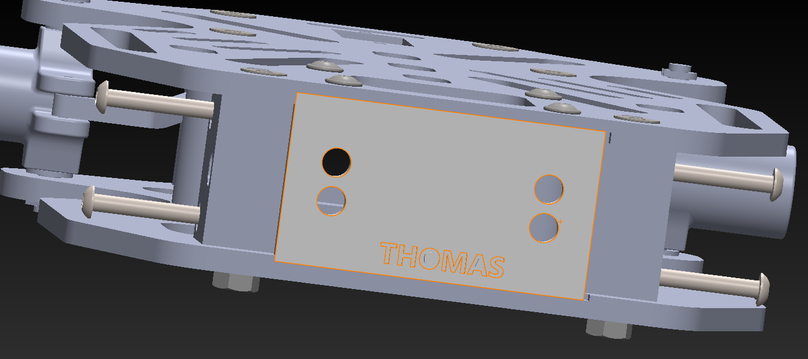

# ⚡ The Amprunners BT Car Project  

> A course project built to demonstrate skills in electronics, microcontroller programming, and system integration.  

---

## 🎯 Project Overview
This project was developed as part of a Pixel's Arduino and SolidWorks course to design and build a working toy car.

The goal was to build the 2 car from scratch, control them wirelessly using:
* Bluetooth module (as used in model APEX)  
* Mobile BT App (seen in model NOVA)

---

## 🛠 Components Used 
**3D model, wheels, chasis and assembly have their own section below*
- **Microcontroller:** Arduino Uno R3 
- **Motor Driver:** L293D H-Bridge  
- **Motors:** 2x DC hobby motors (for RWD)
- **Steering:** SG90 micro servo motor
- **Sensors:** HC-SR04 ultrasonic (for obstacle detection)  
- **Communication:** HC-05 Bluetooth module 
- **Power:** 3.7V Li-ion battery x 3  
- **Sound:** TMB12A05 Active buzzer
- **LEDs:** 3 pairs, red, white, and 3rd's your colour of choice 
## Extra components for model APEX:
- **Control:** KY-023 PS2 joystick module
- **Microcontroller:** Arduino Uno R3 
- **Communication:** HC-05 Bluetooth module 

---

# ⚡ Circuit & System Design
#### Wiring Diagram 
- Wiring on [TinkerCAD](https://www.tinkercad.com/things/3cfGxGtMRQf/editel?returnTo=%2Fdashboard%2Fdesigns%2Fcircuits&sharecode=tggdkWvqcvbUGcP2sUzt5KGX8uSZ4Mat11Dn79PlnLI), or view the circuit as a [.brd file](hardware/circuit.brd)
-


#### Power distribution: 
*connecting the 3 batteries in series using a pack*

    Battery pack --> H-Bridge +12V pin
    H-Bridge 5V pin --> 5V power rail --> Arduino's 5V power pin 
  <small>(more on this later)</small>  

#### Connections table:  

| Component       | Pin / Connection   |
|-----------------|--------------------|
| Motor A IN1     | D2                 |
| Motor A IN2     | D4                 |
| Motor B IN1     | D7                 |
| Motor B IN2     | D8                 |
| Motor A Enable  | D3                 |
| Motor B Enable  | D6                 |
| Servo Control   | D5                 |
| Ultrasonic Trig | D10                |
| Ultrasonic Echo | A0                 |
| BT Module Tx    | D0                 |
| BT Module Rx    | D1                 |
| HeadLights      | D11                |
| Taillights      | D13                |
| Reverse Lights  | D12                |
---

## 💻 Code
Main features of the code:
- Reads instructions from BT module/App.  
- Controls motors' direction & speed (3 in each direction) via H-Bridge.  
- Stops when obstacles are detected by ultrasonic.
- beeps periodically when backing up (like big trucks)   
- toggle on/off lights and buzzer


#### *Code Snippet*
```cpp

void loop() {

  //-----ultrasonic--------
  digitalWrite(trigPin,LOW);
  digitalWrite(trigPin,HIGH);
  delayMicroseconds(10);
  digitalWrite(trigPin,LOW);
  
  time= pulseIn(echoPin,HIGH);
  distance= 0.0343*(time/2);
  
  if(distance<=35){stopFlag=true;}
  else{stopFlag=false;}
  //-----------------------

  if (Serial.available()) {
    read = Serial.read();
    if (read != '0' && read != 'o' && read != 'U' && read != 'D') {
      lastcommand = read;
    }
  }

///rest of code in /src.......

``` 
<sub>IDE: Arduino IDE & VS code
Libraries: Servo.h   
Board: Arduino Uno R3   
Baud rate: 9600 baud   
</sub>   


---


# Chasis & Assembly 
Our team agreed on making the car RWD, rather than AWD; simply because it was more economical

> Using [this model](https://www.thingiverse.com/thing:4772279) made by Pammeg80 on Thingiverse.com as our inspiration , with some slight adjustments

#### Alterations to base model:
1. Made a small hole using SolidWorks to fit the pins for the ultrasonic sensor
-

2. Removed the 9V power at the back, while mounting the 12V pack (mentioned here) under the model 
-

3.  Adding a nameplate with the text ingravement "THOMAS" as our first prototype 
-

##### you can view the model [here](models/APEX&NOVA/Final_THOMAS.SLDASM) along with the rest of the parts for both models

# Testing
### Phase 1: Wiring test
This was done by adding a Keyboard (of varing resistance) to an analogue pin, and using the code map below to test input:

```cpp
//Keypad Resistance Map//
#define ast_KEY 47
#define zero_KEY 51
#define hash_KEY 57
#define seven_KEY 60
#define D_KEY 64
#define eight_KEY 68
#define nine_KEY 79
#define four_KEY 85
#define C_KEY 93
#define five_KEY 102
#define six_KEY 128
#define one_KEY 146
#define B_KEY 171
#define two_KEY 205
#define three_KEY 341
#define A_KEY 1023

#define keyPin A1
```
then using the following function toreturn the keypad values:

```cpp
//funcion for reading the keypad-resistance configuration//
char KeypadReading() {
  int val = analogRead(keyPin);

  // sorted in ascending order with tolerances of 2~4//
  if (val < 44) return 0;  //null if not in range//  
  else if (val < 49) return '*';
  else if (val < 53) return '0';
  else if (val < 59) return '#';
  else if (val < 62) return '7';
  else if (val < 66) return 'D';
  else if (val < 70) return '8';
  else if (val < 82) return '9';
  else if (val < 88) return '4';
  else if (val < 96) return 'C';
  else if (val < 105) return '5';
  else if (val < 132) return '6';
  else if (val < 150) return '1';
  else if (val < 175) return 'B';
  else if (val < 210) return '2';
  else if (val < 345) return '3';   
  else if (val > 1000 && val <= 1023) return 'A';

  return 0; //null if not in range//
}
``` 
#

### Phase 2: Joystick Implementation
Using a potentiometer (10K Ohm) for steering control, and another (10K Ohm) for motor speed we constructed the following circuit:
-   

and controlled their movement using the code below: 
```cpp
  int steer = map(analogRead(steerPot),0,1023,0,180); //joystick reading for servo
  int drive = map(analogRead(hobbyPot),0,1023,0,255); //joystick reading for motor
  
  Serial.print("steer= ");
  Serial.print(steer);
  Serial.print("||drive= ");
  Serial.println(drive);
  
  //-----front and back in 3 levels each-----//
  if(drive == 128) {  // ~centered
    digitalWrite(backLED,HIGH);  //not moving
    digitalWrite(reverseLED,LOW); //reverse-light off
  }
  else if(drive > 128){ //going forwards
    forwards(drive); 
    digitalWrite(backLED,LOW); //break-light off
    digitalWrite(reverseLED,LOW); //reverse-light off
  }
  else if(drive < 128){ //going backwards
    backwards(drive); 
    digitalWrite(backLED,LOW); //break-light off
    digitalWrite(reverseLED,HIGH); //reverse-light on
  }

  //-----right and left-----//
  steerMotor.write(steer);
```

---


# Challenges (and how we overcame them)

## 1. 12V power to 5V Arduino:
#### Issue:
>* Feeding 12V into the arduino power plug would instantly fry the circuit
>* using multiple power scouces would be inefficient and require extra wiring complexity
>* Linear voltage regulator need comprehensive understanding (in a small time period)
### Solution: H-bridge power supply
Surprisingly, the **L293D H-Bridge** model has a neat feature activated by adding a jumper cap to a built-in voltage regulator; allowing +12V power to motors and feeding just 5V from it's power slot (normally used to power the module itself)

## 2. H-bridge driving wheels incorrectly
This manifested as both RWD motors being able to move backwards, but motor A (left) failing to drive forwards
#### Cause: 
>Instability from mechanical vibration of motors; resulting in lose conections
#### Solution: Physically fixing connections and insulation
using a hot soldering iron and lead, we were able to Solder connections well, and prevent shorts using Heat shrink tubing at exposed locations


## 3. Car wheels not fitting into chasis
#### Cause:
>no tolerances added during modelling; which lead to an impossible interference fit
#### Solution: Widenning hole with DIY machining
fortunately, we had a drill bit that was exactly the same size as the wheel, so we drilled through 


## 4. Irresponsive Bluetooth Pair (with remote control)
#### Cause:
>modules aren't always recognised by smart devices at specific ports, and won't go into pair or AT mode wgen enabled by pin
#### Solution: Changing baud rate 
It's more of a compatability problem across devices where serial communication is set out of sync, eg. 9600 baud Uno with 11600 BT module


# Future Improvements
### 1. Using an ESP32
* Excellent for managing component space
* Built-in Bluetooth and Wi-Fi for simpler interface and communication
* Faster processing speed, more memory & it's more cost-efficient than the UNO   
### 2. Backwards Obstacle Detection
* reducing impact possiblilty and improving lifespan
* placed right above the nameplate
### 3. Surface-mounted robotic arm  
* for object transportation
* placed right at the center of mass to avoid tipping over
### 4. Infrared light sensor
for line follower feature, used in warehouses
### 5. Camera Module
for object distinction and possible QR/bar code scanning 
